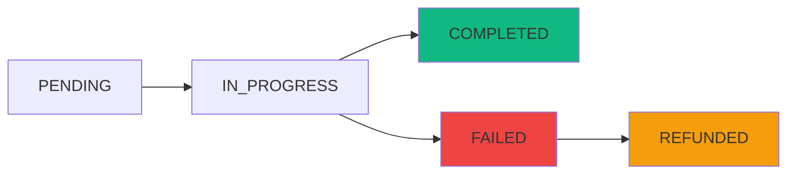

## Overview

The Transactions API provides access to a user's complete transaction history across all chains. It supports pagination for efficient data loading and returns detailed information about swaps, transfers, and their execution status.

## API Methods

### getTransactionHistory

Retrieve paginated transaction history for a user.

```typescript
transactionsApi.getTransactionHistory(
  params: TransactionHistoryParams
): Promise<TransactionHistoryResponse>
```

#### Parameters

<ParamField path="params" type="TransactionHistoryParams" required>
  Pagination and filter parameters
  
  <Expandable title="TransactionHistoryParams Structure">
    <ParamField path="user" type="string" required>
      User's account address (smart contract account address, not wallet address)
    </ParamField>
    
    <ParamField path="limit" type="number" required>
      Maximum number of transactions to return per request (recommended: 10-50)
    </ParamField>
    
    <ParamField path="continuation" type="string">
      Optional continuation token from previous response for pagination. Omit for first page.
    </ParamField>
  </Expandable>
</ParamField>

#### Returns

<ResponseField name="TransactionHistoryResponse" type="object">
  Paginated list of transactions with continuation token
  
  <Expandable title="TransactionHistoryResponse Structure">
    <ResponseField name="transactions" type="Transaction[]">
      Array of transaction objects
      
      <Expandable title="Transaction properties">
        <ResponseField name="quoteId" type="string">
          Unique identifier for the quote/transaction
        </ResponseField>
        
        <ResponseField name="status" type="TransactionStatus">
          Current status: `PENDING` | `COMPLETED` | `FAILED` | `REFUNDED`
        </ResponseField>
        
        <ResponseField name="user" type="string">
          User's account address
        </ResponseField>
        
        <ResponseField name="recipientAccountId" type="string">
          Optional recipient account for transfers
        </ResponseField>
        
        <ResponseField name="type" type="'SWAP' | 'TRANSFER'">
          Type of transaction
        </ResponseField>
        
        <ResponseField name="originToken" type="TokenInfo">
          Source token information
          
          <Expandable title="TokenInfo properties">
            <ResponseField name="aggregatedAssetId" type="string">
              Aggregated asset ID (e.g., "ob:usdc")
            </ResponseField>
            <ResponseField name="amount" type="string">
              Token amount in base units
            </ResponseField>
            <ResponseField name="assetType" type="string | string[]">
              Individual asset type(s) in CAIP-19 format
            </ResponseField>
            <ResponseField name="fiatValue" type="string | object">
              USD value at time of transaction
            </ResponseField>
          </Expandable>
        </ResponseField>
        
        <ResponseField name="destinationToken" type="TokenInfo">
          Destination token information (for swaps)
        </ResponseField>
        
        <ResponseField name="originChainOperations" type="ChainOperation[]">
          Transactions on source chain(s)
          
          <Expandable title="ChainOperation properties">
            <ResponseField name="hash" type="string">
              Transaction hash
            </ResponseField>
            <ResponseField name="chainId" type="number">
              Chain ID where transaction occurred
            </ResponseField>
            <ResponseField name="explorerUrl" type="string">
              Block explorer URL for this transaction
            </ResponseField>
          </Expandable>
        </ResponseField>
        
        <ResponseField name="destinationChainOperations" type="ChainOperation[]">
          Transactions on destination chain (for swaps)
        </ResponseField>
        
        <ResponseField name="timestamp" type="string">
          ISO 8601 timestamp when transaction was initiated
        </ResponseField>
      </Expandable>
    </ResponseField>
    
    <ResponseField name="continuation" type="string">
      Optional token to fetch next page. If undefined, no more results available.
    </ResponseField>
  </Expandable>
</ResponseField>

#### Example

<CodeGroup>
```typescript Fetch First Page
import { transactionsApi } from '@/lib/api/transactions';
import type { TransactionHistoryParams } from '@/lib/types/transaction';

const params: TransactionHistoryParams = {
  user: '0x1234567890abcdef1234567890abcdef12345678',
  limit: 20
};

const response = await transactionsApi.getTransactionHistory(params);

console.log('Loaded transactions:', response.transactions.length);
console.log('Has more:', !!response.continuation);

// Display transactions
response.transactions.forEach(tx => {
  console.log(`${tx.type}: ${tx.originToken.aggregatedAssetId} -> ${tx.destinationToken?.aggregatedAssetId}`);
  console.log(`Status: ${tx.status}`);
  console.log(`Time: ${tx.timestamp}`);
});
```

```typescript Pagination
// Load first page
let params: TransactionHistoryParams = {
  user: accountAddress,
  limit: 20
};

let allTransactions = [];
let response = await transactionsApi.getTransactionHistory(params);
allTransactions.push(...response.transactions);

// Load remaining pages
while (response.continuation) {
  params.continuation = response.continuation;
  response = await transactionsApi.getTransactionHistory(params);
  allTransactions.push(...response.transactions);
}

console.log('Total transactions loaded:', allTransactions.length);
```

```typescript Real Usage (from useTransactionHistory.ts:19)
const data = await transactionsApi.getTransactionHistory(params);
```
</CodeGroup>

## Pagination Pattern

The API uses cursor-based pagination with continuation tokens:

<Steps>
  <Step title="Initial Request">
    Make first request with just `user` and `limit` parameters
    
    ```typescript
    const response = await transactionsApi.getTransactionHistory({
      user: accountAddress,
      limit: 20
    });
    ```
  </Step>
  
  <Step title="Check for More">
    Check if `continuation` token exists in response
    
    ```typescript
    if (response.continuation) {
      // More pages available
    }
    ```
  </Step>
  
  <Step title="Load Next Page">
    Pass continuation token to get next page
    
    ```typescript
    const nextPage = await transactionsApi.getTransactionHistory({
      user: accountAddress,
      limit: 20,
      continuation: response.continuation
    });
    ```
  </Step>
  
  <Step title="Repeat">
    Continue until `continuation` is undefined
  </Step>
</Steps>

## Real-World Implementation

Here's how the transaction history is used in the actual application:

<CodeGroup>
```typescript useTransactionHistory Hook (lines 12-36)
const fetchTransactionHistory = useCallback(async (params: TransactionHistoryParams) => {
  if (!params.user) return;

  setLoading(true);
  setError(null);

  try {
    const data = await transactionsApi.getTransactionHistory(params);

    if (params.continuation) {
      // Append to existing transactions for pagination
      setTransactions(prev => [...prev, ...data.transactions]);
    } else {
      // Replace transactions for initial load or refresh
      setTransactions(data.transactions);
    }

    setContinuation(data.continuation);
    setHasMore(!!data.continuation);
  } catch (err) {
    setError(err instanceof Error ? err.message : 'Failed to fetch transaction history');
  } finally {
    setLoading(false);
  }
}, []);
```

```typescript Load More Function (lines 54-65)
const loadMore = useCallback(
  (limit: number = 10) => {
    if (!userAddress || !continuation || loading) return;

    fetchTransactionHistory({
      user: userAddress,
      limit,
      continuation,
    });
  },
  [userAddress, continuation, loading, fetchTransactionHistory]
);
```
</CodeGroup>

## Transaction Types

<CardGroup cols={2}>
  <Card title="SWAP" icon="arrow-right-arrow-left">
    Token swap transaction between different assets
    
    - Has both `originToken` and `destinationToken`
    - May involve multiple chains
    - Includes price/rate information
  </Card>
  
  <Card title="TRANSFER" icon="paper-plane">
    Token transfer to another account
    
    - Has `recipientAccountId`
    - Only `originToken` is relevant
    - May be cross-chain
  </Card>
</CardGroup>

## Transaction Status Flow



- **PENDING**: Transaction submitted, waiting for blockchain confirmation
- **IN_PROGRESS**: Being processed across chains (OneBalance only)
- **COMPLETED**: Successfully completed on all chains
- **FAILED**: Transaction failed on one or more chains
- **REFUNDED**: Failed transaction with funds returned to user

## Filtering and Display

<CodeGroup>
```typescript Filter by Status
const completedTxs = transactions.filter(tx => tx.status === 'COMPLETED');
const pendingTxs = transactions.filter(tx => 
  tx.status === 'PENDING' || tx.status === 'IN_PROGRESS'
);
```

```typescript Filter by Type
const swaps = transactions.filter(tx => tx.type === 'SWAP');
const transfers = transactions.filter(tx => tx.type === 'TRANSFER');
```

```typescript Sort by Date
const sortedTxs = [...transactions].sort((a, b) => 
  new Date(b.timestamp).getTime() - new Date(a.timestamp).getTime()
);
```
</CodeGroup>

## Display Transaction Details

<CodeGroup>
```typescript Format Transaction
import { formatUnits } from 'viem';

function formatTransaction(tx: Transaction) {
  const fromAmount = formatUnits(
    BigInt(tx.originToken.amount),
    // Get decimals from asset metadata
    18
  );
  
  const timestamp = new Date(tx.timestamp).toLocaleString();
  
  return {
    id: tx.quoteId,
    type: tx.type,
    from: `${fromAmount} ${tx.originToken.aggregatedAssetId}`,
    to: tx.destinationToken 
      ? `${formatUnits(BigInt(tx.destinationToken.amount), 18)} ${tx.destinationToken.aggregatedAssetId}`
      : 'N/A',
    status: tx.status,
    time: timestamp,
    explorerUrl: tx.originChainOperations[0]?.explorerUrl
  };
}
```
</CodeGroup>

## Error Handling

<CodeGroup>
```typescript Error Handling
try {
  const response = await transactionsApi.getTransactionHistory(params);
  return response;
} catch (error) {
  if (error instanceof Error) {
    console.error('Failed to fetch transaction history:', error.message);
    
    // Handle specific errors
    if (error.message.includes('invalid address')) {
      // Show address validation error
    } else if (error.message.includes('rate limit')) {
      // Back off and retry
    }
  }
  
  throw error;
}
```
</CodeGroup>

## Best Practices

<CardGroup cols={2}>
  <Card title="Reasonable Page Size" icon="list">
    Use 10-50 transactions per page for optimal performance and UX
  </Card>
  
  <Card title="Cache Results" icon="database">
    Cache transaction data to avoid unnecessary API calls on navigation
  </Card>
  
  <Card title="Show Loading States" icon="spinner">
    Display loading indicators during pagination for better UX
  </Card>
  
  <Card title="Handle Empty States" icon="inbox">
    Show helpful messages when users have no transaction history
  </Card>
</CardGroup>

## Related APIs

- [Quotes API](/api/quotes) - For checking individual quote status
- [Balances API](/api/balances) - For current account balances

## Related Types

- [Transaction](/api/types/transaction#transaction) - Complete transaction structure
- [TransactionHistoryParams](/api/types/transaction#transactionhistoryparams) - Request parameters
- [TransactionHistoryResponse](/api/types/transaction#transactionhistoryresponse) - Response structure